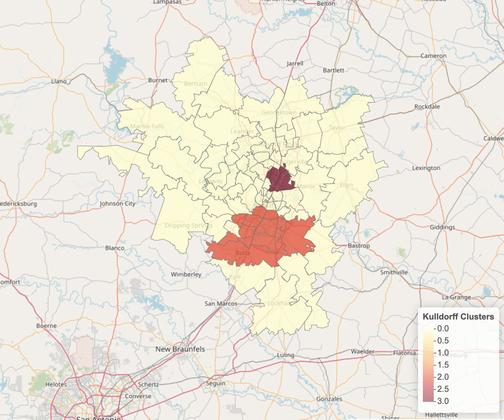

# atxsatscan
Determining COVID-19 case burden from calculating the observed to expected case ratio at the zip code level, and finding COVID-19 clusters using a discrete Poisson spatial scan statistic. This analysis was limited to the greater Austin area (Bastrop, Caldwell, Hays, Travis and Williamson counties). **The case data per zip code was last updated October 1st, 2020.**

### Contextual factors used in this analysis include:
(letters correspond to figure below)

A: Race and Ethnicity (white, black or african american, hispanic or latino, asian)

B: Transit to work (car of van, bus or train, worked from home)

C: Income (defined as proportion of individuals with cash public assistance or food stamps / SNAP)

D: Educational Attainment (high school Diploma, bachelor's, doctorate)

E: Insurance status (has health insurance, has no health insurance)

Each choropleth maps displays the observed to expected case ratios for each zip code, with respect to each contextual factor. 

This map displays the two major Kulldorff clusters obtained from the Poisson spatial scan statistic. 

**Contextual factor analysis of race and ethnicity, educational attainment, and insurance status all produced a common cluster in north central Austin (located northeast of Airport Boulevard around East Rundberg Lane), while transit status and income level shared shared a larger cluster in southeast Austin (extending from Buda to east Riverside drive south of Town Lake).** 

The scale in the legend corresponds to the number of contextual factors that demonstrated clustering at each zip code. 

### Please refer to [this link](./SpatialEpidemiology_SpatialScan.html) for interactive maps featuring per zip code labels 
(download html > right or ctrl click Save As > open downloaded html text file in browser)

